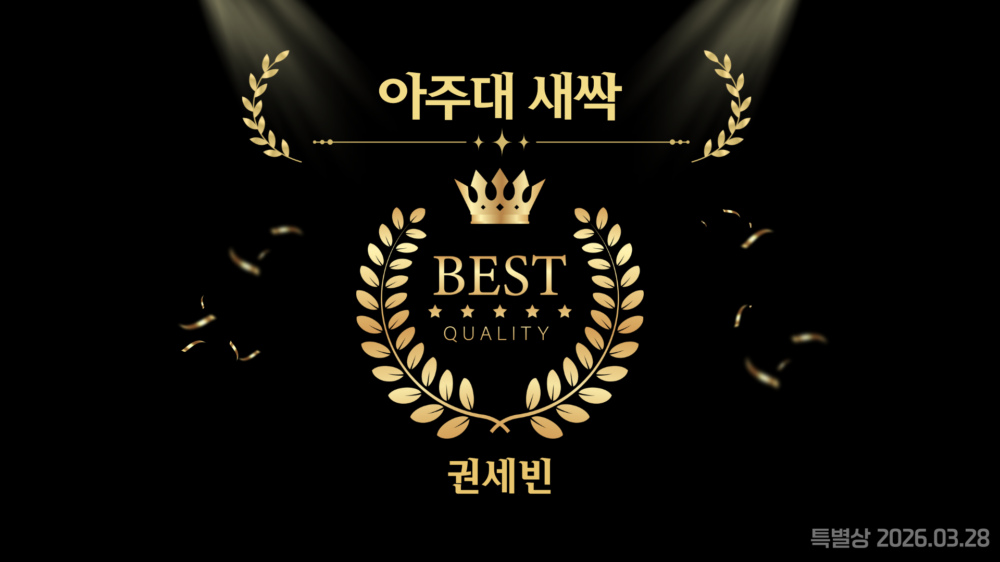
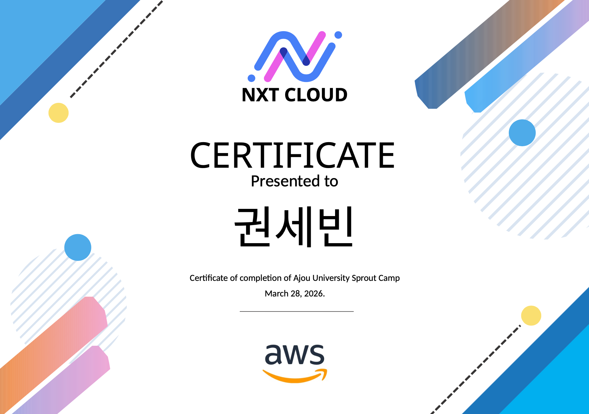

# 인적성 Sprint

[](./README.md)
[](./README.md)
[](./README.md)

실전형 인적성 풀이 환경, 오답 모의고사 자동 재구성, 전략 중심 AI 해설을 한 번에 제공하는 웹 서비스입니다.

**NXT CLOUD 아이디어톤 특별상 수상 프로젝트**입니다.

## Awards & Certificates

<p align="center">
  
  
</p>

<p align="center">
  <sub>상장</sub>
  &nbsp;&nbsp;&nbsp;&nbsp;
  <sub>수료증</sub>
</p>

## Overview

실제 시험 흐름에 맞춘 풀이 환경 위에 오답 재훈련과 전략 중심 복기를 결합한 서비스입니다.  
단순 채점보다 "실전 흐름 유지", "오답 재배치", "다음 풀이에 바로 쓰는 피드백"에 집중했습니다.

## Features

주요 기능은 다음과 같습니다.

- 실전형 풀이 화면 제공
- 오답 문제 업로드 및 OCR 기반 텍스트 추출
- 오답 기반 모의고사 자동 재구성
- 결과 분석 및 AI 전략 해설
- 세션 저장과 이어풀기를 위한 세션 관리

## Deploy

이 프로젝트는 OCR/AI 호출, 세션 관리, 서버 측 API 처리 흐름이 함께 필요했습니다.  
이 때문에 정적 호스팅만으로는 구성하기 어려웠고, 서버 환경을 유연하게 제어할 수 있도록 EC2 기반으로 배포를 진행했습니다.


## Current Status

현재는 아이디어톤 당시 제공받았던 인프라 및 외부 자원을 더 이상 사용할 수 없어 서비스를 실제로 이용할 수는 없습니다.  
이 저장소는 포트폴리오 용도로 정리한 버전이며, 당시 구현한 기능 구조와 사용자 흐름, 기술 선택을 확인할 수 있도록 공개했습니다.

## Tech Stack

- Next.js 15 App Router
- TypeScript
- Tailwind CSS
- Zustand
- Prisma
- MySQL
- OpenAI-compatible API 연동

## Routes

- `/`
  랜딩 페이지 및 서비스 소개
- `/login`
  로그인 진입 화면
- `/dashboard`
  학습 현황 및 문제풀이 진입
- `/solve/[sessionId]`
  실제 풀이 세션 진행 화면
- `/sessions/[sessionId]/results`
  결과 확인 및 전략 피드백 화면
- `/wrong-questions/upload`
  오답 업로드 및 OCR 확인 화면

## Local Setup

1. `.env.example` 파일을 참고해 `.env`를 생성합니다.
2. 로컬 MySQL 데이터베이스와 필요한 API 키를 설정합니다.
3. 의존성을 설치합니다.

```bash
npm install
```

4. Prisma 마이그레이션 및 시드 데이터를 준비합니다.

```bash
npx prisma migrate dev --name init
npm run db:seed
```

5. 개발 서버를 실행합니다.

```bash
npm run dev
```

6. 브라우저에서 `http://localhost:3000`으로 접속합니다.

## Notes

- 민감 정보, 로컬 개발 메타데이터, 빌드 산출물은 제거했습니다.
- AI 연동이 없더라도 일부 흐름은 fallback 로직으로 동작하도록 구성되어 있습니다.
- 실제 운영 버전은 대회 환경 자원을 사용했기 때문에 현재 공개 저장소만으로는 완전히 동일하게 재현되지 않을 수 있습니다.
